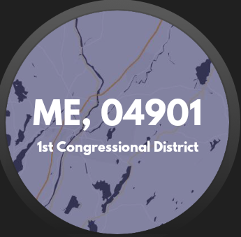
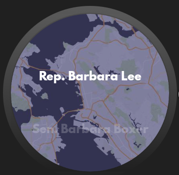
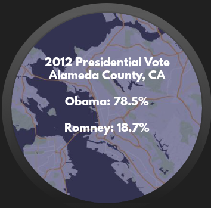

# PROG 02: Represent!

This app looks up the Congressional representatives of a given region, either specified by a zipcode or a latitude / longitude coordinate. For each representative, the app will show the representative's portrait, website, email, committees, sponsored bills, most recent tweet, party affiliation, and name. An accompanying Android Wear app shows the location's county vote results for the 2012 election, and can control the mobile app.

## Authors

Eric Chen ([erchpito@berkeley.edu](mailto:erchpito@berkeley.edu))

## Demo Video

See [a demo of the app here](https://youtu.be/ByKvzI1Jkr0).

## Screenshots

## Acknowledgments

Twitter, Sunlight Foundation, Google, ProgrammingLife, and various StackOverflow users.
